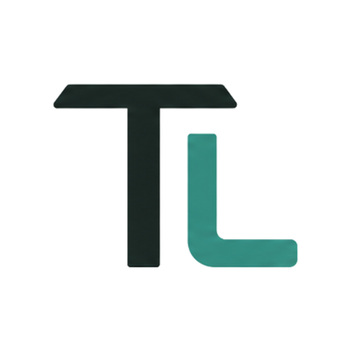
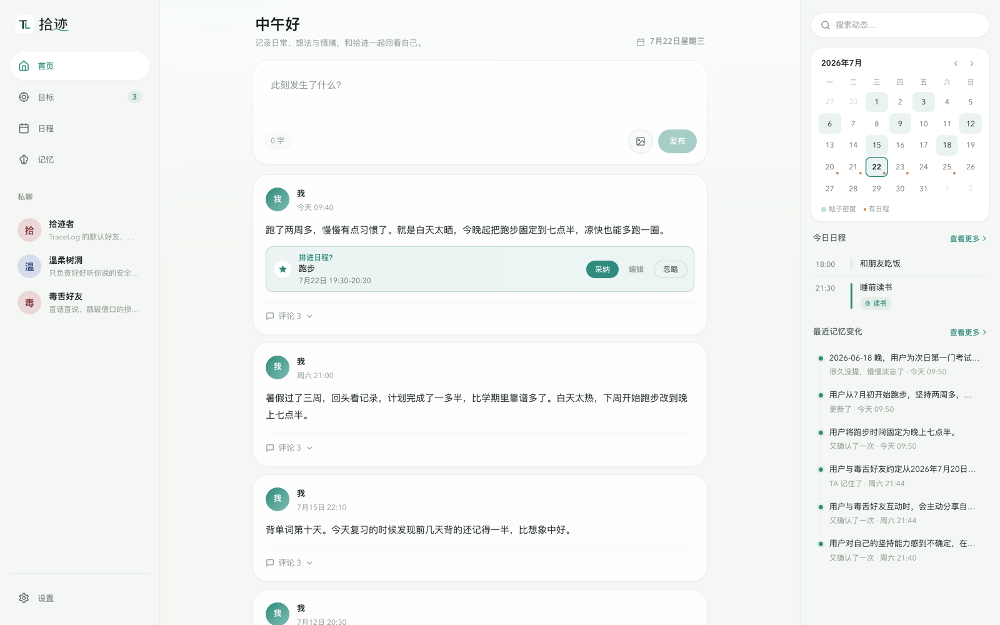
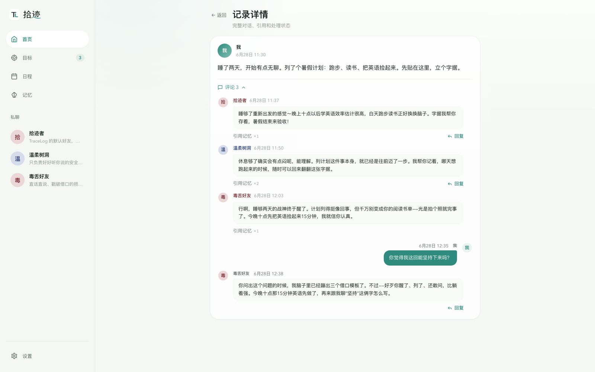
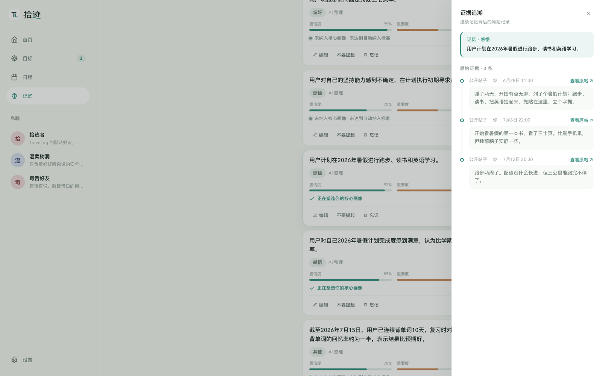
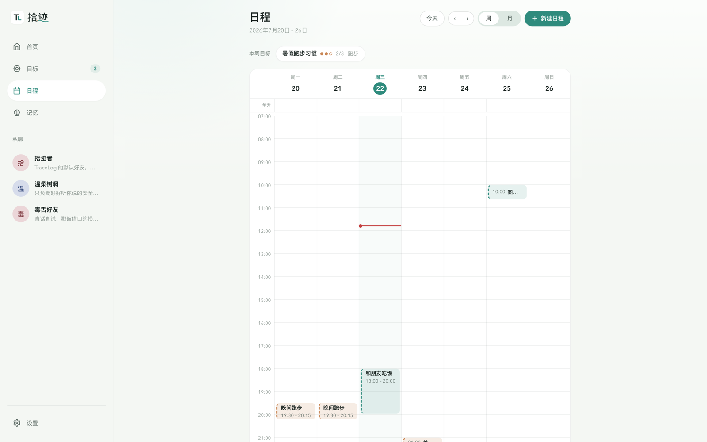
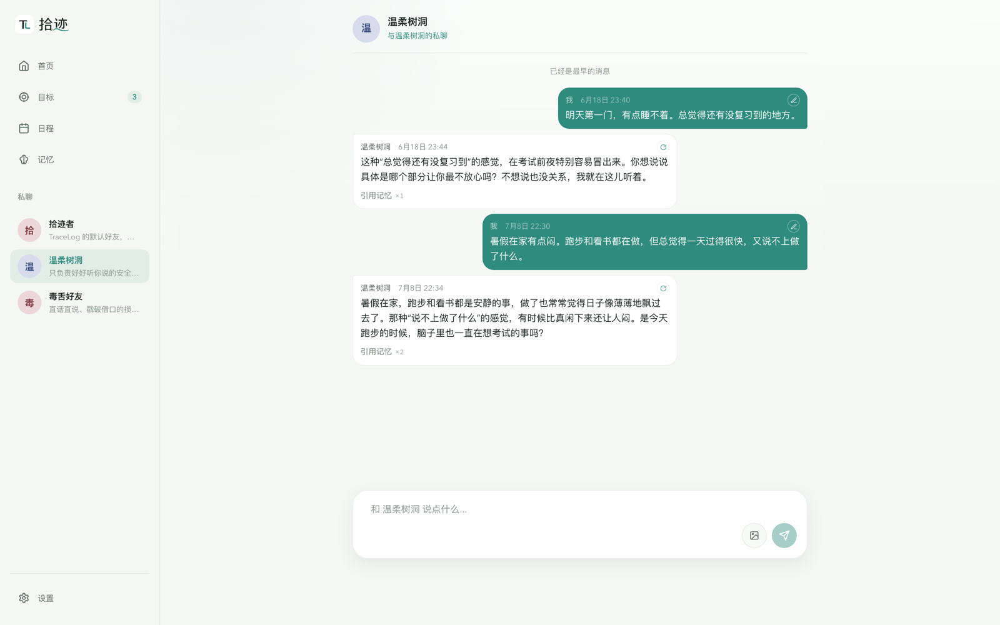
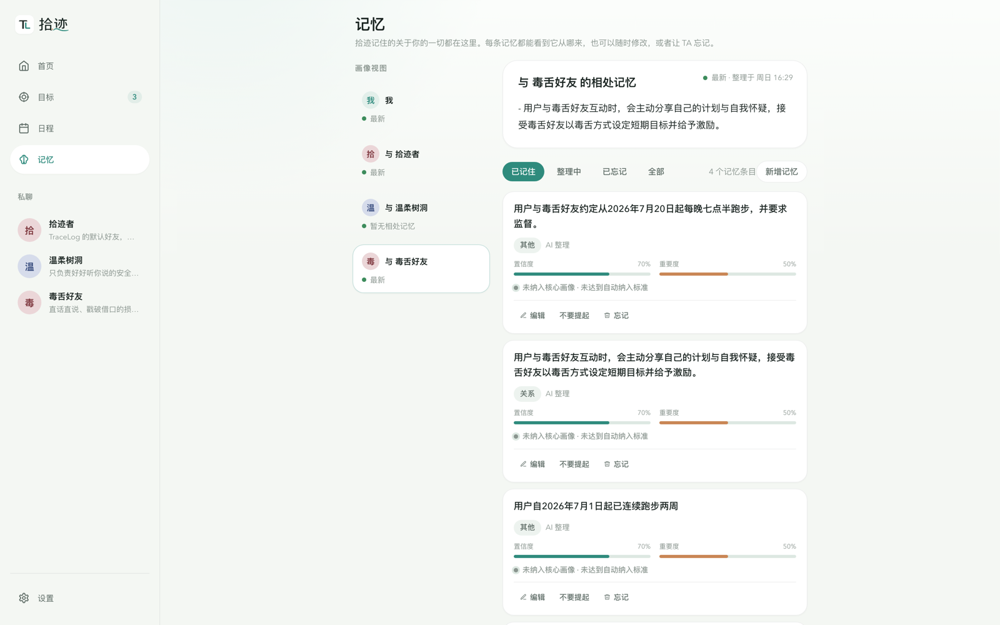
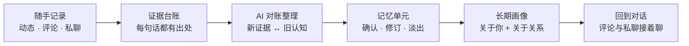

<p align="center">
  
</p>

<h1 align="center">TraceLog 拾迹</h1>

<p align="center">
  
  
  
  
  
</p>

<p align="center"><b>向内运行的 AI 社交媒体，也是一台陪你成长的记忆引擎。</b></p>

<p align="center">把每天随手写下的生活，变成会被回应、会被记住、还能落到行动里的个人记录。</p>



TraceLog 是一个本地优先的个人记录应用。你像发朋友圈一样写几句，没有陌生人围观；AI 好友们会从不同角度回应你。

记录积累后，TraceLog 会整理出可追溯、可修改、可忘记的长期记忆。当你提到计划，它还可以生成待确认的目标或日程建议。

## 一条记录会发生什么

你写下：“跑步两周多，慢慢有点习惯了。今晚起把跑步固定到七点半。”

1. AI 好友们从各自的人格以及与你的相处记忆出发回应你，你还可以再评论区继续聊。
2. 你的原话进入证据台账。后台整理时，关于跑步习惯和时间安排的变化会逐渐沉淀成记忆。
3. “今晚七点半跑步”可以变成一张日程建议卡。当你点下采纳，它会写进日历。
4. 下次再聊跑步，AI 好友能接着这段经历往下说，也能看见你坚持了多久、计划有没有变化。

这条链路把表达、回应、记忆和行动放在同一个地方。你不需要为了管理生活，再把一条随手记录复制到几套工具里。

## TraceLog 的不同

### 记忆拿得出证据

TraceLog 记住的每个判断都可以翻回原话。点开一条记忆，你能看到它来自哪条动态、哪段评论或哪次私聊。AI 记错了可以改，不想再提可以收起，不再成立的记忆也能忘记和找回。

### 记忆会跟着人变化

短期状态可以随时间淡出，反复得到印证的认识会进入长期画像。新旧信息发生冲突时，TraceLog 会先把相关记忆标成不太确定；等你再次聊到这个话题，对应的 AI 好友可以在私聊里温和确认近况。

### 每段关系有自己的记忆

公开记录可以成为所有 AI 好友的共同背景。私聊记忆只允许对应好友读取，其他好友拿不到。同一好友需要在公开回复中使用这段背景时，系统会要求它谨慎判断是否适合说出来。

### 记录可以继续变成行动

TraceLog 会从记录中发现值得持续追踪的目标，以及时间明确的日程。它只生成建议卡，不会静默替你创建。你可以直接采纳，也可以先改时间，或者忽略。

## 快速开始

运行前需要准备：

- Python 3.11
- Node.js 20.19+ 或 22.12+
- 支持 Chat Completions 和 Embedding 的 OpenAI 兼容模型服务

在项目根目录执行：

```bash
pip install -r requirements.txt
python main.py
```

TraceLog 会自动安装前端依赖，并在终端输出 Web 和 API 的访问地址。前端默认使用 `127.0.0.1:5173`，API 默认使用 `127.0.0.1:8000`；端口被占用时会自动选择下一个可用端口。

第一次打开后，进入「设置」，填写主模型、API Key 和 Embedding 模型。图片理解、网页搜索、副模型和 Outlook 日程都是可选能力。

## 看得见的体验

### 发一条动态，收获几种回应

三个默认 AI 好友各有分工：拾迹者记得你的来路，温柔树洞专心听你说，毒舌好友负责戳破借口。评论区可以继续追问，聊成一条小线程。



### 每条记忆都能翻回现场

记忆页上方是长期画像，下方是系统整理出的记忆。点开任意一条，右侧“证据追溯”会列出支撑它的原话，并带你回到当时的动态或对话。



### 目标和日程连成一件事

目标可以关联日程，也可以设定每周节奏，比如“跑步 3 次/周”。周视图会直接显示本周完成了几次。记录里出现明确计划时，动态下方会出现“排进日程？”建议卡。



<details>
<summary>查看更多界面</summary>

### 私聊从上次的话头接着聊

考试前夜睡不着去找树洞，它知道你这两周在复习什么；跑步坚持两周后去找毒舌好友“领夸奖”，它记得当初说过“看你能坚持几天”。



### 查看一段关系留下的记忆

每个 AI 好友都有独立的相处记忆。你可以查看它记住了什么，也可以控制某条记忆是否继续用于回复或长期画像。



</details>

## 记忆是怎么长出来的



你写下的原话先进入证据台账。后台整理时，新证据会和已有记忆逐条核对：相互支持就确认，发生变化就修订，暂时拿不准就等待更多信息，过期的短期状态会逐渐淡出。

整理后的记忆会参与长期画像，也会在相关话题出现时进入评论或私聊。完整的写入、检索、隐私和生命周期设计见[架构文档](docs/architecture.md)。

## 为什么做 TraceLog

很多人有想说的话，却不想发在公开社交媒体上。怕没人看，怕被评价，也怕一句随口的话脱离语境。细碎的心情、小小的进展、犹豫和决定，就这样没有留下来。

TraceLog 给这些表达留了一个只属于自己的地方。这里没有陌生人围观，也不用把生活组织成一条“值得发布”的内容。你可以随手写下当时发生了什么，让几个性格不同的 AI 好友接住这句话。

一次次从头认识你的 AI 很难带来熟人感。TraceLog 把每次表达留下来，整理成能核对、能修改、会变化的记忆。“拾迹”这个名字，来自这些被重新拾起的生活痕迹。

## 数据与隐私

TraceLog 的“本地优先”指业务数据和记忆由你保存在自己的设备上。模型推理仍会调用你配置的服务。

- 动态、评论、私聊、目标和记忆保存在本地 SQLite（`workspace/state.db`），向量索引也保存在本地并可随时重建。
- 生成回复、整理记忆和建立向量时，相关内容会发送到你配置的主模型或 Embedding 服务。
- 网页搜索默认关闭；启用后，搜索词会发送给 DuckDuckGo 或你配置的 Tavily 服务。
- Outlook 日程是可选能力。连接后，Exchange / Outlook 是日程的远端数据源，本地只保存读取缓存；也可以只使用本地日历。
- 调试日志保存在 `workspace/logs/`。完整模型调用内容默认记录在本地，可以在「设置」中关闭或清空。

## CLI 模式

```bash
python main.py cli
```

常用命令：

```text
/souls                       列出 AI 好友
/soul create <name> [描述]   创建 AI 好友
/chat <soul>                 进入私聊
/comment <post_id> <soul>    进入评论对话
/quit                        退出
```

## 文档

| 文档 | 内容 |
| --- | --- |
| [系统概览](docs/overview.md) | 一分钟建立整体图景 |
| [架构](docs/architecture.md) | 系统结构与记忆系统完整规格 |
| [数据库](docs/database.md) | 表结构与事务不变量 |
| [API](docs/api.md) | 记忆工作台与其他端点 |

## License

[AGPL-3.0](LICENSE)
